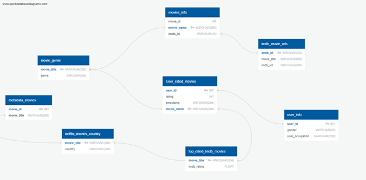

# ETL Project
# The Movies Dataset

The objective of this project is to perfrom ETL process on various movies listed in the Full MovieLens Dataset. The dataset is obtained from Kaggle, and includes the following iformation:

* Movie title
* Genre
* Budget
* Country of origin
* IMDB ID
* Original language
* Release date
* Average vote

## Extract

Data comes from the following sources:

https://www.kaggle.com/rounakbanik/the-movies-dataset/version/7?select=movies_metadata.csv

https://www.imdb.com/chart/top/

We did web scraping from IMDB website to get the top rated movies along with their ratings and saved them in a csv file which is saved as the jupyter notebook.

## Transformation

The following steps are taken to transform the public data to suit project requirements using Python and pandas:

* Data cleaning
* Dropping duplicates
* Dropping NaN values
* Filtering
* Aggregation and grouping
* Joining

## Load

The final output is loaded into a database. This database is a PostgresSQL database created using pgAdmin. After we pulled in the CSV files and loaded them into the data frames, we made an initial connection to the Postgres database using pgAdmin to store our original clean datasets. We used the quick database website to create the initial table schema that got loaded into the Postgres database that generated the first set of tables. After running the queries and creating the new tables with only the relevant information, we reconnected to the database and generated additional tables for the dataframes.

